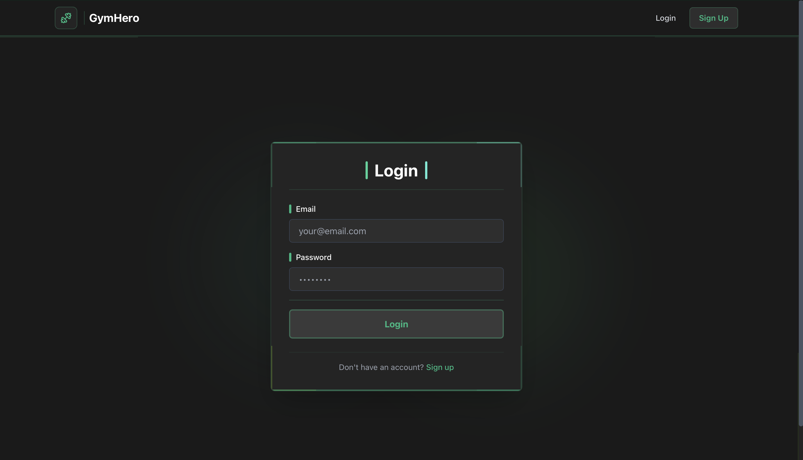
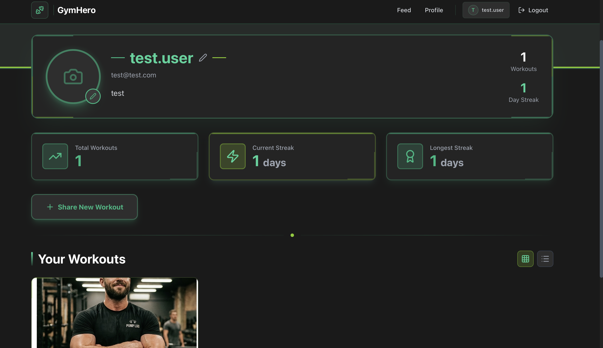
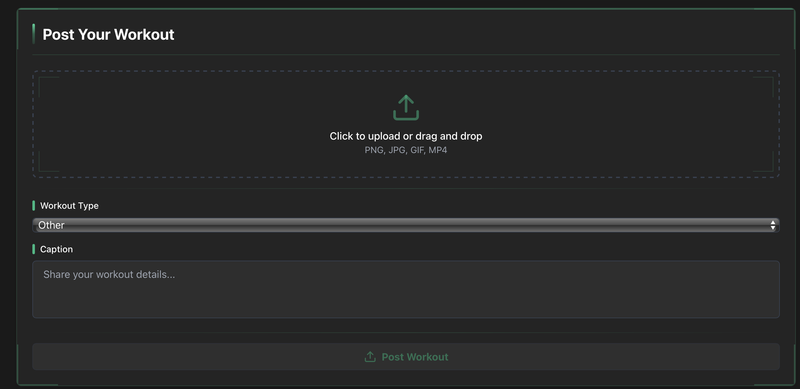

# GymHero - Fitness Workout Tracking App

A full-stack web application for tracking and sharing gym workouts.

**Metropolia Ammattikorkeakoulu**  
**Hybridisovellukset TX00EY68-3003**  
**Tekijä:** Abdullah Aljubury  
**Päivämäärä:** Maaliskuu 2026

---

##  Julkaistut Sovellukset

- **Frontend (Netlify):** https://gymhero-gh.netlify.app/
- **Backend API (Railway):** [https://gymhero-production.up.railway.app](https://gymhero-production.up.railway.app)
- **API Dokumentaatio:** [API Endpoints](#-api-dokumentaatio)

---

## Projektikuvaus

GymHero on moderni full-stack web-sovellus kuntoilun ja treenien seurantaan. Sovelluksessa käyttäjät voivat:

- Jakaa treeni-kuvia ja -videoita
- Seurata omaa treeniputkea (streak)
- Nähdä tilastoja omista treeneistä
- Selata muiden käyttäjien treenipostauksia
- Tykätä ja kommentoida muiden treenejä

- Tykätä ja kommentoida muiden treenejä

---


### Kirjautuminen


_Käyttäjän kirjautumissivu JWT-autentikaatiolla_

### Käyttäjäprofiili


_Käyttäjän profiili tilastoineen (Total Workouts, Current Streak, Longest Streak)_

### Treenin Lataus


_Treenin latauslomake kuvien/videoiden lataamiseen_


### Tilastonäkymä


_Yksityiskohtaiset tilastot ja streaks_

---

##  Teknologiat

**Backend:**

- Node.js + Express (TypeScript)
- SQLite database
- JWT authentication
- Multer for file uploads

**Frontend:**

- React 18 (TypeScript)
- Tailwind CSS
- React Router
- Axios


---

##  Tietokanta

### Tietokantarakenne (SQLite)

Sovellus käyttää SQLite-relaatiotietokantaa neljällä taululla:

#### **users** - Käyttäjätiedot

```sql
CREATE TABLE users (
  id INTEGER PRIMARY KEY AUTOINCREMENT,
  username TEXT UNIQUE NOT NULL,
  email TEXT UNIQUE NOT NULL,
  password_hash TEXT NOT NULL,
  profile_picture TEXT,
  bio TEXT,
  created_at DATETIME DEFAULT CURRENT_TIMESTAMP
);
```

#### **workouts** - Treenipostaukset

```sql
CREATE TABLE workouts (
  id INTEGER PRIMARY KEY AUTOINCREMENT,
  user_id INTEGER NOT NULL,
  media_url TEXT NOT NULL,
  media_type TEXT NOT NULL,
  caption TEXT,
  workout_type TEXT,
  created_at DATETIME DEFAULT CURRENT_TIMESTAMP,
  FOREIGN KEY (user_id) REFERENCES users(id) ON DELETE CASCADE
);
```

#### **likes** - Tykkäykset

```sql
CREATE TABLE likes (
  id INTEGER PRIMARY KEY AUTOINCREMENT,
  user_id INTEGER NOT NULL,
  workout_id INTEGER NOT NULL,
  created_at DATETIME DEFAULT CURRENT_TIMESTAMP,
  FOREIGN KEY (user_id) REFERENCES users(id) ON DELETE CASCADE,
  FOREIGN KEY (workout_id) REFERENCES workouts(id) ON DELETE CASCADE,
  UNIQUE(user_id, workout_id)
);
```

#### **comments** - Kommentit

```sql
CREATE TABLE comments (
  id INTEGER PRIMARY KEY AUTOINCREMENT,
  user_id INTEGER NOT NULL,
  workout_id INTEGER NOT NULL,
  text TEXT NOT NULL,
  created_at DATETIME DEFAULT CURRENT_TIMESTAMP,
  FOREIGN KEY (user_id) REFERENCES users(id) ON DELETE CASCADE,
  FOREIGN KEY (workout_id) REFERENCES workouts(id) ON DELETE CASCADE
);
```

### Tietokantasuhteet

- Yksi käyttäjä voi luoda monta treeniä (1:N)
- Yksi treeni kuuluu yhdelle käyttäjälle (N:1)
- Käyttäjät voivat tykätä treeneistä (N:M)
- Käyttäjät voivat kommentoida treenejä (N:M)
- Foreign key -rajoitteet varmistavat tietojen eheyden
- ON DELETE CASCADE poistaa automaattisesti liittyvät tiedot

---


### Autentikaatio

**POST** `/api/auth/register`

- Luo uusi käyttäjätili
- Body: `{ username, email, password }`
- Palauttaa: JWT token ja userId

**POST** `/api/auth/login`

- Kirjaudu sisään
- Body: `{ email, password }`
- Palauttaa: JWT token ja userId

### Treenit

**GET** `/api/workouts`

- Hae käyttäjän omat treenit
- Vaatii: JWT token
- Palauttaa: Lista treeneistä

**POST** `/api/workouts`

- Lataa uusi treeni
- Vaatii: JWT token, multipart/form-data
- Body: `media` (file), `caption`, `workout_type`
- Palauttaa: Luotu treeni

**GET** `/api/workouts/:id`

- Hae yksittäinen treeni
- Vaatii: JWT token
- Palauttaa: Treeni-objekti

**DELETE** `/api/workouts/:id`

- Poista treeni (vain omistaja)
- Vaatii: JWT token
- Palauttaa: Success message

**GET** `/api/workouts/feed`

- Hae kaikkien käyttäjien treenit (julkinen syöte)
- Ei vaadi autentikaatiota
- Palauttaa: Lista treeneistä

### Tilastot

**GET** `/api/users/:id/stats`

- Hae käyttäjän tilastot
- Vaatii: JWT token
- Palauttaa: `{ userId, total_workouts }`

**GET** `/api/users/:id/streaks`

- Hae käyttäjän treeniputket
- Vaatii: JWT token
- Palauttaa: `{ userId, current_streak, longest_streak, total_unique_workout_days }`

---

##  Toteutetut Toiminnallisuudet

### 1. **Käyttäjähallinta**

- Rekisteröityminen (username, email, password)
- Kirjautuminen
- JWT-pohjainen autentikaatio
- Salasanojen bcrypt-hajautus
- Suojatut API-reitit (middleware)

### 2. **Treenipostaukset**

- Kuvien ja videoiden lataus (Multer)
- Pilvitallennus (Cloudinary)
- Treenilajiluokittelu (push, pull, legs, cardio, full-body)
- Kuvatekstit (caption)
- Aikaleima jokaiselle postaukselle
- Medialajin tunnistus (image/video)


### 3. **Tilastot ja Streaks**

- Kokonaistreenimäärän laskenta
- Nykyisen treeniputken laskenta (consecutive days)
- Pisimmän treeniputken tallennus
- Uniikit treenipäivät
- Reaaliaikainen tilastojen päivitys

### 4. **Tykkäykset ja Kommentit**

- Tietokantarakenne valmiina
- Foreign key -suhteet määritelty

### 5. **Tietoturva**

- Password hashing (bcryptjs)
- JWT token expiration (7 päivää)
- CORS-konfiguraatio
- Input validation
- SQL injection -suojaus (parametrisoidut kyselyt)

### 6. **TypeScript**

- 100% TypeScript backend
- 100% TypeScript frontend
- Jaetut interface-määrittelyt

### 8. **Deployment**

- Backend julkaistu Railway-palvelussa
- Frontend julkaistu Netlify-palvelussa
- Ympäristömuuttujien hallinta
- Automaattinen deployment (CI/CD)

---

## 🐛 Tiedossa Olevat Bugit / Ongelmat

### Korjattu:

- ~~Database not syncing to Railway~~ Korjattu (lisätty `.gitignore`-poikkeuksiin)
- ~~CORS errors between Netlify and Railway~~ Korjattu (päivitetty CORS-asetukset)
- ~~File uploads not working in production~~ Korjattu (Cloudinary konfiguroitu)

### Keskeneräiset toiminnot:

- **Likes & Comments Frontend** - Backend valmis, mutta frontend-UI kesken
- **Profile Picture Upload** - Tietokanta tukee, mutta UI puuttuu
- **User Bio** - Tietokanta tukee, mutta UI puuttuu

### Tunnetut rajoitukset:

- Streak calculation - käyttää UTC-aikaa, ei paikallista aikavyöhykettä

---

## Referenssit ja Lähteet

### Käytetyt Tutoriaalit:

- **JWT Authentication**: [JWT.io Documentation](https://jwt.io/)
- **Express + TypeScript**: [Official Express TypeScript Guide](https://expressjs.com/)
- **Multer File Uploads**: [Multer NPM Documentation](https://www.npmjs.com/package/multer)
- **React TypeScript**: [React TypeScript Cheatsheet](https://react-typescript-cheatsheet.netlify.app/)

### Grafiikka ja UI:

- **Tailwind CSS**: [https://tailwindcss.com/](https://tailwindcss.com/)
- **Lucide React Icons**: [https://lucide.dev/](https://lucide.dev/)
- **Design Inspiration**: Material Design, Modern Fitness Apps

### Pilvialustat:

- **Cloudinary**: [https://cloudinary.com/](https://cloudinary.com/) - Media storage
- **Railway**: [https://railway.app/](https://railway.app/) - Backend hosting
- **Netlify**: [https://www.netlify.com/](https://www.netlify.com/) - Frontend hosting

### NPM Paketit:

- `express` - Web server framework
- `typescript` - Static typing
- `bcryptjs` - Password hashing
- `jsonwebtoken` - JWT tokens
- `multer` - File uploads
- `cloudinary` - Cloud media storage
- `sqlite3` - Database
- `cors` - Cross-origin requests
- `dotenv` - Environment variables
- `react` - Frontend framework
- `react-router-dom` - Frontend routing
- `axios` - HTTP client

### AI-Avustus:

- **GitHub Copilot** käytetty koodin kirjoittamisessa (~20% backend, ~25% frontend)
- **ChatGPT/Github copilot** käytetty debuggauksessa ja ongelmanratkaisussa

---

## Käyttöönotto (Localhost)

### 1. Backend Setup

```bash
# Navigate to backend folder
cd gymhero

# Install dependencies
npm install

# Create environment file
cp .env.example .env

# Edit .env file with your credentials
# Add Cloudinary credentials if using cloud storage

# Start the backend server
npm run dev
```

Backend will run on: `http://localhost:3000`

### 2. Frontend Setup

```bash
# Navigate to frontend folder (in a new terminal)
cd gymhero-frontend

# Install dependencies
npm install

# Create environment file
echo "REACT_APP_API_URL=http://localhost:3000/api" > .env

# Start the frontend
npm start
```

Frontend will run on: `http://localhost:3001`

---

## Käyttöohje

1. Avaa selaimessa `http://localhost:3001` (tai julkaistu Netlify-URL)
2. Rekisteröidy uudella käyttäjätilillä
3. Kirjaudu sisään tunnuksillasi
4. Lataa treeni: valitse kuva/video, valitse treenilajiluokka, lisää kuvateksti
5. Selaa syötettä nähdäksesi muiden treenejä
6. Tarkastele tilastojasi profiilisivulla

testi käyttäjä
email test@test.com
password 123456789


```

---

## 👨‍💻 Tekijä

**Abdullah Aljubury**  
Metropolia Ammattikorkeakoulu   
abdullah.aljubury@metropolia.fi

**Kurssi:** Hybridisovellukset TX00EY68-3003  
**Opettaja:** [Opettajan nimi]  
**Lukukausi:** Kevät 2026

---
